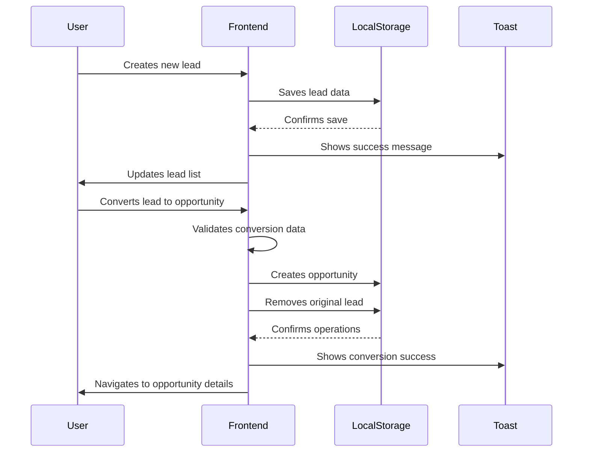

# Mini-Seller Console

A modern sales management platform that transforms your leads into opportunities and drives revenue growth with powerful pipeline tracking and conversion tools.

### Tech Stack

- **Framework:** React 19.1.1 with Vite 7.1.2
- **Language:** TypeScript 5.8.3
- **Navigation:** React Router DOM 7.9.1
- **State Management:** React Hooks with Custom Hook Pattern
- **Forms & Validation:** React Hook Form 7.62.0 + Zod 4.1.8
- **HTTP Client:** Fetch API (with local storage fallback)
- **Styling:** Tailwind CSS 4.1.13 + Radix UI Components
- **Storage:** LocalStorage with JSON serialization
- **Key Libraries/Services:** TanStack Table, Lucide React, Sonner (toasts), Class Variance Authority

<div align="center" style="display: inline_block justify-center"><br>
   </div>

## 🚀 Main Features

- **Lead Management** - Capture, organize, and track leads with powerful filtering and search capabilities
- **Opportunity Conversion** - Seamlessly convert qualified leads into opportunities with detailed tracking
- **Pipeline Management** - Track opportunities through different stages from initial contact to closing
- **Analytics & Insights** - Get valuable insights into your sales pipeline with comprehensive reporting
- **Multi-Currency Support** - Handle international sales with proper currency formatting and localization
- **Local-First Architecture** - No backend required, perfect for demos and single-user scenarios

## 📊 Core Application Flow



## ⚡ How to Run Locally

1. Clone the repository:
   ```bash
   git clone [repository_url] cd mini-seller-console
   ```
2. Install dependencies:
   ```bash
   npm install
   ```
3. Start the development server:
   ```bash
   npm run dev
   ```
4. Open your browser and navigate to `http://localhost:5173`

## 📚 Learn More

For full details on architecture, features, components, and improvement suggestions, please see the [complete documentation](./documentation.md).

---

made with ♥ by [giacomosalsano](https://giacomosalsano.com)! <!-- Update with your actual website URL -->
